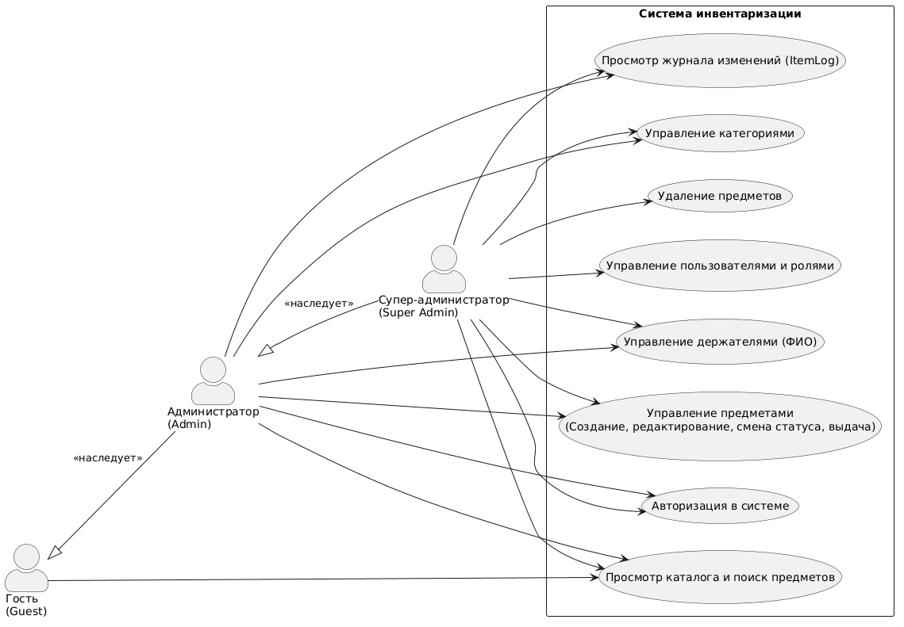
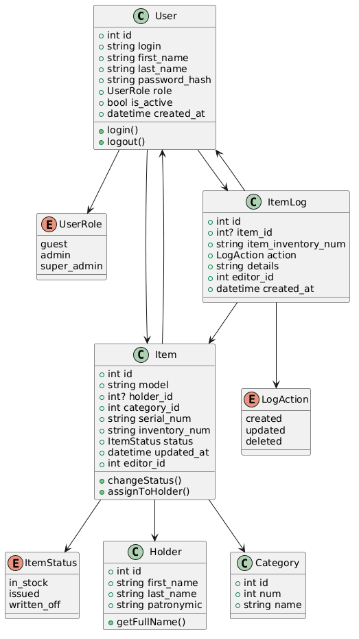
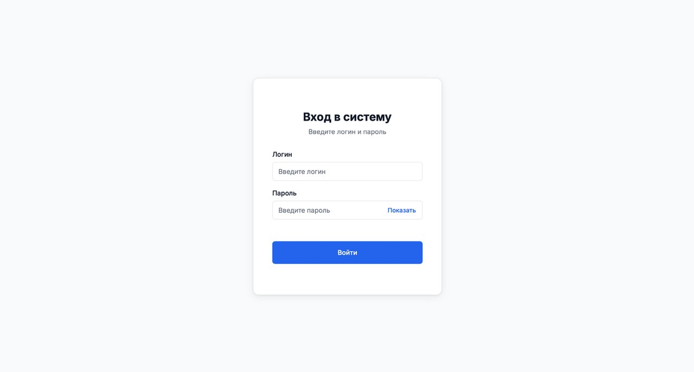
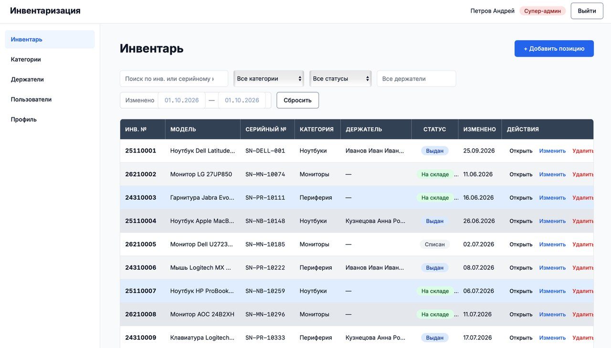
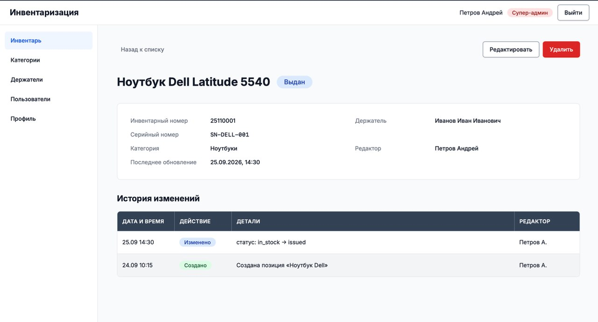
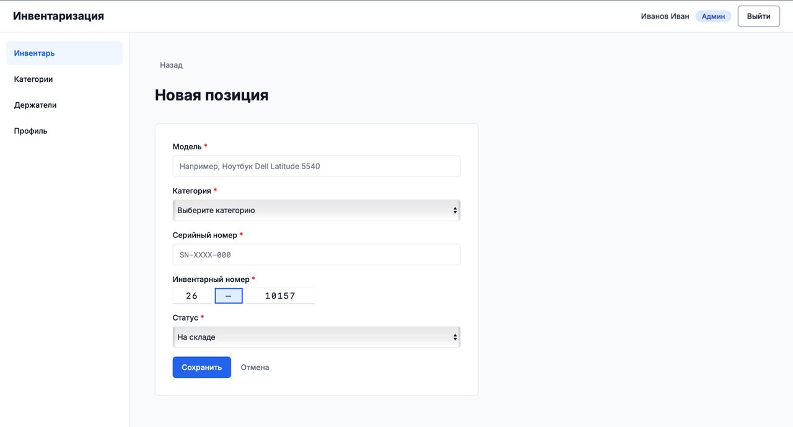
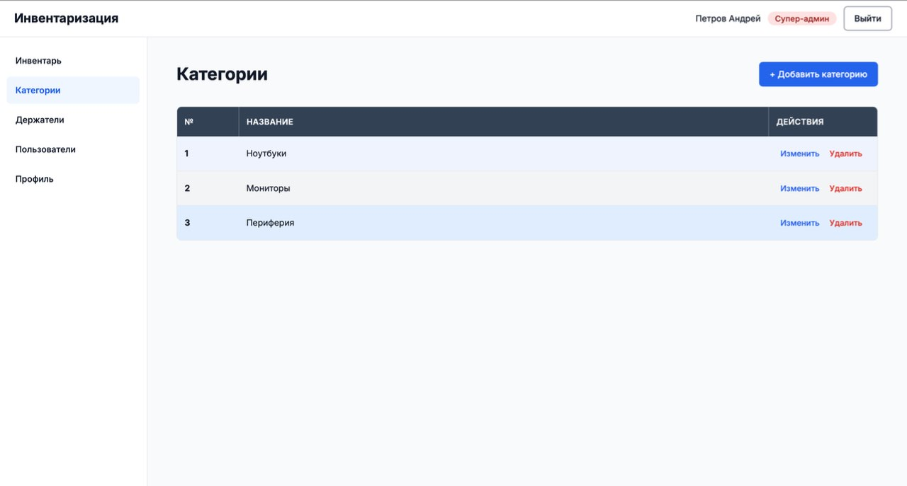
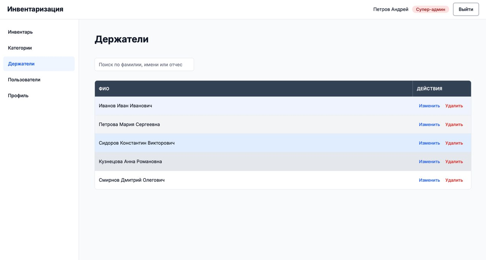
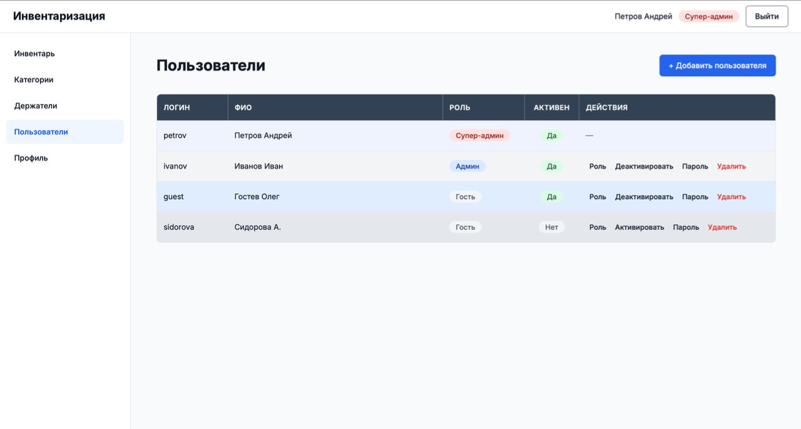
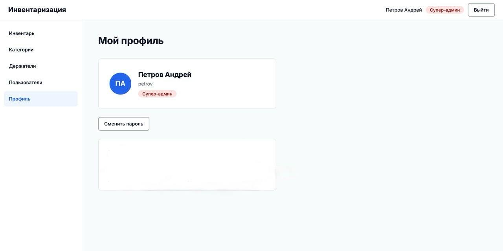

# Система инвентаризации

Учебный проект по дисциплине **«Создание программного обеспечения»**.

Веб-приложение для учёта техники и оборудования организации: ноутбуки, мониторы, комплектующие, периферия и т.д.

## Команда

| Участник | Роль |
|----------|------|
| Беляева Анна Павловна | Тимлид |
| Кайзер Даниил Дмитриевич | Аналитик |
| Славгородский Сергей Романович | Бэкенд-разработчик |
| Ичкеева Софья Мингияновна | Фронтенд-разработчик |

## Содержание

- [1. Предметная область](#1-предметная-область)
- [2. Методология](#2-методология)
- [3. Технологический стек](#3-технологический-стек)
- [4. Ролевая модель](#4-ролевая-модель)
- [5. Диаграмма прецедентов](#5-диаграмма-прецедентов)
- [6. Диаграмма классов](#6-диаграмма-классов)
- [7. Бизнес-логика](#7-бизнес-логика)
- [8. Экраны приложения](#8-экраны-приложения)

---

## 1. Предметная область

Система инвентаризации помогает учитывать всю технику и оборудование: ноутбуки, мониторы, комплектующие, периферию и т.д.

**Зачем это нужно:**

- понимать, что есть на складе;
- знать, кто из сотрудников какую технику получил;
- видеть, где что находится прямо сейчас;
- хранить историю: кто, когда и что брал.

**Как это работает:**

1. Поступает новая техника — администратор добавляет вещь в систему.
2. Система генерирует инвентарный номер.
3. Сотруднику выдают технику: выбираем человека из списка, выдаём.
4. Сотрудник вернул технику: возвращаем на склад.
5. Техника сломалась/устарела — списываем.

## 2. Методология

- **Разработка:** Agile/Scrum — работаем по спринтам, регулярно показываем результат.
- **Моделирование:** OOAD — строим UML-диаграммы перед тем, как писать код.
- **Сбор требований:** Use Case Driven — отталкиваемся от того, что должен уметь делать пользователь.

## 3. Технологический стек

| Компонент | Технология |
|-----------|------------|
| Backend | Python + FastAPI |
| База данных | PostgreSQL |
| Frontend | JS + React |
| Аутентификация | JWT-токены + хеширование паролей (bcrypt) |
| Ролевая модель | Три роли: `guest` / `admin` / `super_admin` |

## 4. Ролевая модель

### Гость (guest)

Пользователь с минимальными правами (например, стажёр или сотрудник из другого отдела, которому нужно просто посмотреть, что есть на складе).

**Может:**

- смотреть каталог предметов (модель, категория, текущий статус);
- искать по инвентарному номеру, серийнику или модели.

**Не может:**

- смотреть журнал изменений;
- что-либо менять, создавать, удалять;
- видеть, кто последний редактировал предмет.

### Администратор (admin)

Ответственный за учёт техники.

**Может:**

- всё, что гость;
- создавать новые предметы;
- редактировать данные предметов (модель, номера, категорию);
- менять статусы: выдать, вернуть на склад, списать;
- назначать держателя при выдаче;
- вести справочник держателей;
- вести справочник категорий;
- смотреть полную историю изменений любого предмета.

**Не может:**

- создавать/удалять пользователей;
- менять роли другим пользователям;
- полностью удалять предметы из системы (только списывать);
- включать/отключать учётные записи пользователей.

### Супер-администратор (super_admin)

 Главный администратор системы.

**Может:**

- всё, что администратор;
- создавать новых пользователей;
- редактировать пользователей (ФИО, логин);
- назначать и менять роли (сделать из гостя админа и наоборот);
- активировать/деактивировать пользователей;
- полностью удалять предметы (физическое удаление из БД);
- смотреть системные логи: кто, когда и что делал;
- принудительно менять статусы без ограничений.

### Матрица доступа к операциям

| Операция | Гость | Администратор | Супер-админ |
|----------|:-----:|:--------------:|:------------:|
| Просмотр каталога предметов | ✅ | ✅ | ✅ |
| Поиск предметов | ✅ | ✅ | ✅ |
| Просмотр категорий | ❌ | ✅ | ✅ |
| Создание предмета | ❌ | ✅ | ✅ |
| Редактирование предмета | ❌ | ✅ | ✅ |
| Удаление предмета | ❌ | ❌ | ✅ |
| Изменение статуса | ❌ | ✅ | ✅ |
| Назначение держателя | ❌ | ✅ | ✅ |
| Управление категориями | ❌ | ✅ | ✅ |
| Управление держателями | ❌ | ✅ | ✅ |
| Просмотр журнала изменений | ❌ | ✅ | ✅ |
| Создание пользователей | ❌ | ❌ | ✅ |
| Редактирование пользователей | ❌ | ❌ | ✅ |
| Управление ролями | ❌ | ❌ | ✅ |
| Деактивация пользователей | ❌ | ❌ | ✅ |

## 5. Диаграмма прецедентов

**Акторы:**

- гость — минимальный доступ, только просмотр;
- администратор — операционная работа с инвентарём;
- супер-администратор — полное управление системой.

**Прецеденты:**

- *Доступны всем:* просмотр каталога и поиск предметов.
- *Только для администраторов (admin + super_admin):* управление предметами (создание, редактирование, смена статуса, выдача); управление категориями; управление держателями (ФИО сотрудников); просмотр журнала изменений (ItemLog).
- *Только для super_admin:* удаление предметов; управление пользователями и ролями.

*Admin наследует все права guest, super_admin наследует все права admin.*

## 6. Диаграмма классов

Диаграмма отражает структуру базы данных и основные сущности backend-части.

**Основные классы:**

- **User** — пользователь системы.
  - Атрибуты: `id`, `login`, `first_name`, `last_name`, `password_hash`, `role` (enum: `guest`/`admin`/`super_admin`), `is_active`, `created_at`.
  - Методы: `login()`, `logout()`.
- **Item** — предмет инвентаря.
  - Атрибуты: `id`, `model`, `holder_id` (опционально), `category_id`, `serial_num`, `inventory_num`, `status` (enum: `in_stock`/`issued`/`written_off`), `updated_at`, `editor_id`.
  - Методы: `changeStatus()`, `assignToHolder()`.
- **Holder** — сотрудник, которому выдана техника.
  - Атрибуты: `id`, `first_name`, `last_name`, `patronymic`.
  - Методы: `getFullName()`.
- **Category** — категория предметов.
  - Атрибуты: `id`, `num`, `name`.
- **ItemLog** — журнал изменений.
  - Атрибуты: `id`, `item_id` (может быть `NULL`), `item_inventory_num`, `action` (enum: `created`/`updated`/`deleted`), `details`, `editor_id`, `created_at`.

**Связи:**

- `User → Item`: один пользователь редактирует много предметов (через `editor_id`);
- `User → ItemLog`: один пользователь создаёт много записей в журнале;
- `Item → Holder`: предмет может быть выдан одному держателю (или никому);
- `Item → Category`: каждый предмет в одной категории;
- `Item → ItemLog`: у предмета много записей в журнале.

## 7. Бизнес-логика

- **Аудит.** Каждое действие (создание, изменение, удаление) записывается в `ItemLog` с указанием, кто (`editor_id`) и когда (`created_at`). Это позволяет отследить всю историю предмета.
- **Удаление.** Когда `super_admin` удаляет предмет, в `ItemLog` остаётся запись с инвентарным номером (`item_inventory_num`), но связь `item_id` обнуляется. Так история сохраняется, даже если предмет физически удалён.
- **Статусы:**
  - `in_stock` — на складе, можно выдавать;
  - `issued` — выдан сотруднику, числится за держателем;
  - `written_off` — списан (сломан, устарел), не участвует в учёте.
- **Держатели.** Поле `holder_id` может быть `NULL` — это нормально, когда предмет на складе. При выдаче админ создаёт или выбирает существующего держателя.
- **Генерация номеров.** Инвентарный номер имеет структуру «префикс года — код категории — порядковый номер» (например, 25110001: 25 — год, 1 — категория, 10001 — порядковый номер). **Третья цифра номера — код категории — подставляется автоматически** в зависимости от выбранной категории. Серийный номер вводит админ (номер от производителя).

## 8. Экраны приложения

Ниже приведены **общие экраны и экраны супер-администратора**: интерфейс администратора является подмножеством интерфейса супер-администратора, а интерфейс гостя — просмотрной версией без данных о держателях и кнопок действий. Различия ролей на каждом экране соответствуют матрице доступа (раздел 4).

Сводная таблица доступа к экранам:

| Экран | Гость | Админ | Супер-админ |
|-------|:-----:|:-----:|:-----------:|
| Вход | ✅ (до авторизации) | ✅ | ✅ |
| Список предметов | просмотр и поиск | + создание, редактирование, статусы | + полное удаление |
| Карточка предмета | просмотр (без держателя и журнала) | + редактирование, статусы, журнал | + полное удаление |
| Новая позиция | ❌ | ✅ | ✅ |
| Категории | только просмотр | управление | управление |
| Держатели | ❌ | ✅ | ✅ |
| Пользователи | ❌ | ❌ | ✅ |
| Профиль | ✅ | ✅ | ✅ |

Состав левого меню зависит от роли: гостю доступны «Инвентарь», «Категории» (просмотр) и «Профиль»; администратору дополнительно — «Держатели»; супер-администратору — ещё и «Пользователи». В шапке всех экранов отображаются имя текущего пользователя и кнопка «Выйти».

### 8.1. Вход

Стартовый экран системы. Форма «Вход в систему»: поля «Логин» и «Пароль» (с кнопкой «Показать»), кнопка «Войти». Экран одинаков для всех; после авторизации система определяет роль пользователя и открывает соответствующий набор вкладок и действий.

### 8.2. Список предметов (супер-админ)

Основной рабочий экран — каталог всей техники в виде таблицы: инв. №, модель, серийный №, категория, держатель, статус, «изменено», действия. Над таблицей — строка поиска (по инвентарному номеру, серийнику, модели) и фильтры: по категории, статусу и диапазону дат изменения. Со списка доступны переход в карточку предмета и создание новой позиции.

*Различия ролей (по матрице доступа):* просмотр каталога и поиск доступны всем ролям. Гость видит таблицу в режиме чтения: скрыты колонка «Держатель», сведения о последнем редактировании и кнопки действий — создавать, менять и удалять он не может. Администратор дополнительно создаёт и редактирует предметы, меняет статусы и назначает держателей, но удалять предметы не может. Супер-администратору доступно и полное удаление предмета.

### 8.3. Карточка предмета (супер-админ)

Детальная информация о предмете: модель, инвентарный и серийный номера, категория, текущий статус, дата последнего изменения. Кнопки действий: редактирование, операции смены статуса (выдать / вернуть на склад / списать) с назначением держателя, для супер-администратора — удаление. Ниже размещён раздел «История изменений» — журнал `ItemLog`: дата и время, действие, детали, автор (например: «статус: in_stock → issued», редактор — Петров А.).

*Различия ролей (по матрице):* гость видит карточку только в режиме чтения — без данных о держателе и без журнала изменений. Администратор может редактировать предмет, менять статус, назначать держателя и просматривать журнал, но кнопка удаления ему недоступна (только списание). Супер-администратор дополнительно может полностью удалить предмет.

### 8.4. Новая позиция (админ и супер-админ)

Форма создания предмета: модель, категория, серийный номер (заводской номер от производителя), инвентарный номер, статус (по умолчанию «На складе»). Кнопки «Сохранить» и «Отмена».

**Особенность инвентарного номера:** его **третья цифра — код категории — проставляется автоматически** в зависимости от выбранной категории. В форме позиция этой цифры обозначена разделителем: администратор вводит префикс года и порядковую часть номера, а категорийную цифру подставляет система.

*Различия ролей (по матрице):* создание предмета доступно только администратору и супер-администратору — у гостя кнопки добавления нет. Форма для обеих ролей идентична.

### 8.5. Вкладка «Категории» (супер-админ)

Справочник категорий: таблица «№ / Название / Действия» с кнопками «Изменить» и «Удалить» по каждой строке, вверху — кнопка «+ Добавить категорию».

*Различия ролей (по матрице):* просмотр списка категорий доступен всем ролям, включая гостя, — но у гостя вкладка работает в режиме чтения: без колонки действий и кнопки добавления. Управление категориями (создание, редактирование, удаление) доступно администратору и супер-администратору; интерфейс для обеих ролей идентичен.

### 8.6. Вкладка «Держатели» (админ и супер-админ)

Справочник держателей — сотрудников, которым выдаётся техника: поиск по фамилии, имени и отчеству; таблица «ФИО / Действия» с кнопками «Изменить» и «Удалить». Справочник используется при выдаче предмета.

*Различия ролей (по матрице):* управление держателями доступно только администратору и супер-администратору; у гостя вкладка в меню отсутствует — ему запрещено видеть ФИО сотрудников (в списке предметов держатель также скрыт).

### 8.7. Вкладка «Пользователи» (супер-админ)

Управление учётными записями: таблица «Логин / ФИО / Роль / Активен / Действия», вверху — кнопка «+ Добавить пользователя». Отсюда выполняются создание и редактирование пользователей, назначение и смена ролей (Гость / Админ / Супер-админ), активация и деактивация учётных записей.

*Различия ролей (по матрице):* экран доступен только супер-администратору — создание, редактирование пользователей, управление ролями и деактивация учётных записей остальным ролям запрещены.

### 8.8. Вкладка «Профиль»

Информация о текущем пользователе: аватар, ФИО, логин и роль; кнопка «Сменить пароль» для смены собственного пароля. Вкладка доступна всем ролям.

